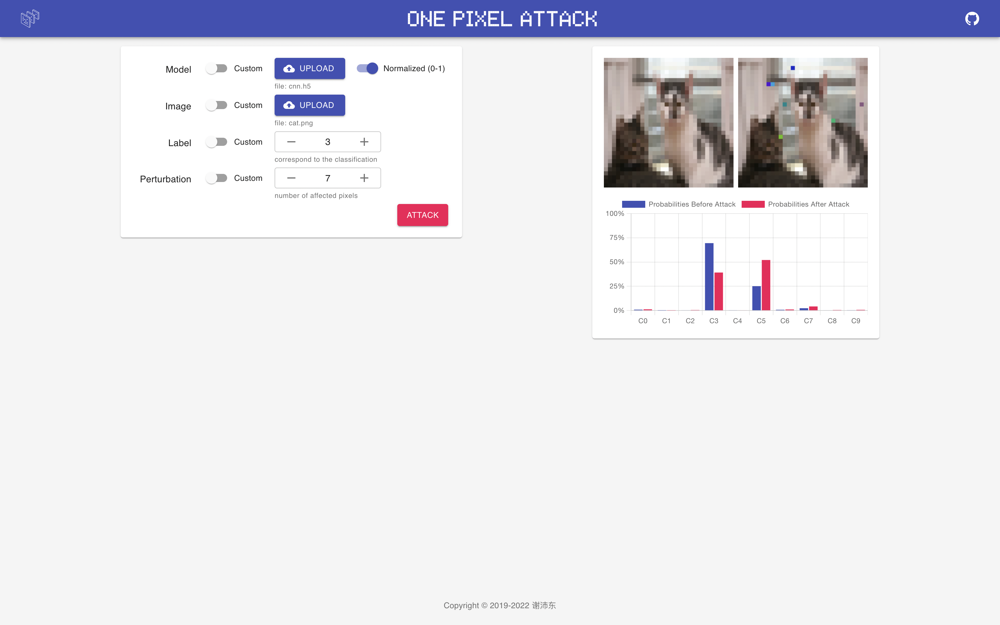

# OnePixelAttack

<p align="center">
  
</p>
<p align="center">
  
  
</p>
<p align="center">
  
</p>

An adversarial image generator

In many cases, it is simple to fool the neural network by changing a small number of pixels in the image. A good adversarial image generator can make this much easier.

This project contains:

- A configurable pixel perturbation solver
- An intuitive user interface

## Table of Contents

- [Background](#background)
- [Installation](#installation)
- [Usage](#usage)
- [Related Efforts](#related-efforts)
- [Maintainers](#maintainers)
- [Contributing](#contributing)
- [License](#license)

## Background

OnePixelAttack was inspired by ['One pixel attack for fooling deep neural networks'](https://arxiv.org/abs/1710.08864). I found that I could borrow its principles to make a tool that could meet the following characteristics:

- Input configurable
- Output intuitive
- Easy to use

As a result, I made an adversarial image generator. In January 2020, I started developing version 1.0 of the project based on Python. In September 2021, I started developing version 2.0 of the project based on Python bindings.

## Installation

This project uses Node.js and its package manager. Please make sure they are installed locally.

```sh
$ git clone https://github.com/peidongxie/one-pixel-attack
$ cd one-pixel-attack
$ npm install
```

or

```sh
$ git clone https://github.com/peidongxie/one-pixel-attack
$ cd one-pixel-attack
$ yarn
```

## Usage

This project can be started in production mode or development mode.

For production mode:

```sh
$ npm run build -ws
$ npm run start -w backend & npm run start -w frontend
```

or

```sh
$ yarn build
$ yarn start
```

For development mode:

```sh
$ npm run dev -w backend & npm run dev -w frontend
```

or

```sh
$ yarn dev
```

## Related Efforts

- [Boa](https://github.com/imgcook/boa)
- [Chart.js](https://github.com/chartjs/Chart.js)
- [MUI](https://github.com/mui-org/material-ui)
- [NumPy](https://github.com/numpy/numpy)
- [One Pixel Attack](https://github.com/Hyperparticle/one-pixel-attack-keras)
- [React](https://github.com/facebook/react)
- [SciPy](https://github.com/scipy/scipy)
- [TensorFlow](https://github.com/tensorflow/tensorflow)

## Maintainers

[@peidongxie](https://github.com/peidongxie)

## Contributing

Feel free to open an [issue](https://github.com/peidongxie/one-pixel-attack/issues/new) or [PR](https://github.com/peidongxie/one-pixel-attack/compare).

## License

[MIT](LICENSE) © 谢沛东
