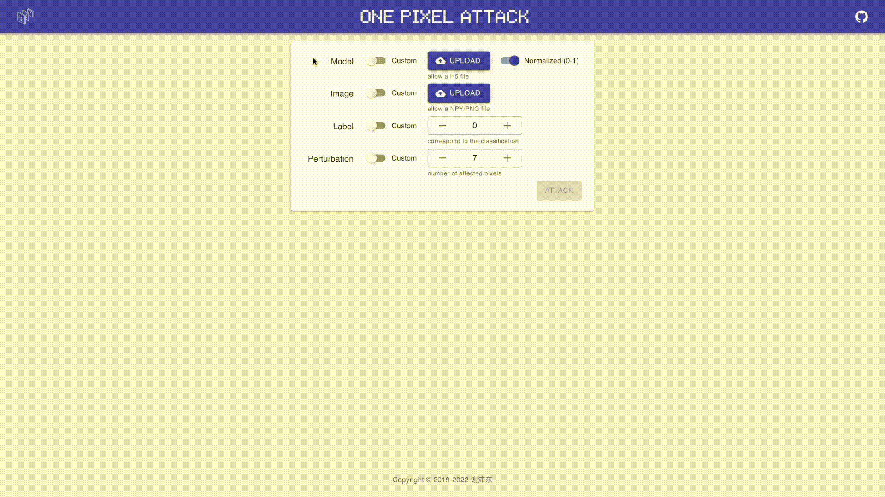

# OnePixelAttack

<p align="center">
  
</p>
<p align="center">
  
  
</p>
<p align="center">
  
</p>

对抗性图像生成器

在许多情况下，通过改变图像中少量像素来欺骗神经网络是很容易的。一个优秀的对抗性图像生成器可以让这一切变得更加简单。

本项目包含以下内容：

- 一个可配置的像素求解器
- 一个直观的用户界面

## 内容列表

- [背景](#背景)
- [安装](#安装)
- [使用](#使用)
- [相关工作](#相关工作)
- [维护者](#维护者)
- [如何贡献](#如何贡献)
- [使用许可](#使用许可)

## 背景

OnePixelAttack 受到 ['One pixel attack for fooling deep neural networks'](https://arxiv.org/abs/1710.08864) 一文的启发。 我发现我可以借鉴它的原理制作一个能够满足以下特性的工具:

- 输入可配置
- 输出直观
- 易于使用

于是，我制作了一个对抗性图像生成器。2020 年 1 月，我开始基于 Python 开发项目的 1.0 版本。2021 年 9 月，我开始基于 Python 绑定开发项目的 2.0 版本。

## 安装

本项目使用 Node.js 和它的包管理器。请确保本地安装了它们。

```sh
$ git clone https://github.com/peidongxie/one-pixel-attack
$ cd one-pixel-attack
$ npm install
```

或者

```sh
$ git clone https://github.com/peidongxie/one-pixel-attack
$ cd one-pixel-attack
$ yarn
```

## 使用

本项目可以以生产模式或开发模式启动。

对于生产模式：

```sh
$ git clone https://github.com/peidongxie/one-pixel-attack
$ cd one-pixel-attack
$ npm run build -ws
$ npm run start -w backend & npm run start -w frontend
```

或者

```sh
$ git clone https://github.com/peidongxie/one-pixel-attack
$ cd south-wind
$ yarn build
$ yarn start
```

对于开发模式：

```sh
$ git clone https://github.com/peidongxie/one-pixel-attack
$ cd one-pixel-attack
$ npm run dev -w backend & npm run dev -w frontend
```

或者

```sh
$ git clone https://github.com/peidongxie/one-pixel-attack
$ cd south-wind
$ yarn dev
```

## 相关工作

- [Boa](https://github.com/imgcook/boa)
- [Chart.js](https://github.com/chartjs/Chart.js)
- [MUI](https://github.com/mui-org/material-ui)
- [NumPy](https://github.com/numpy/numpy)
- [One Pixel Attack](https://github.com/Hyperparticle/one-pixel-attack-keras)
- [React](https://github.com/facebook/react)
- [SciPy](https://github.com/scipy/scipy)
- [TensorFlow](https://github.com/tensorflow/tensorflow)

## 维护者

[@peidongxie](https://github.com/peidongxie)

## 如何贡献

欢迎提 [issue](https://github.com/peidongxie/one-pixel-attack/issues/new) 或 [PR](https://github.com/peidongxie/one-pixel-attack/compare)。

## 使用许可

[MIT](LICENSE) © 谢沛东
